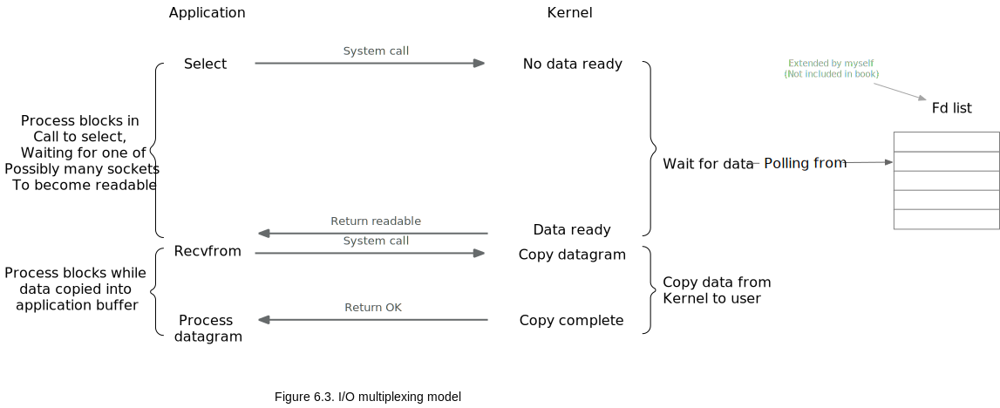
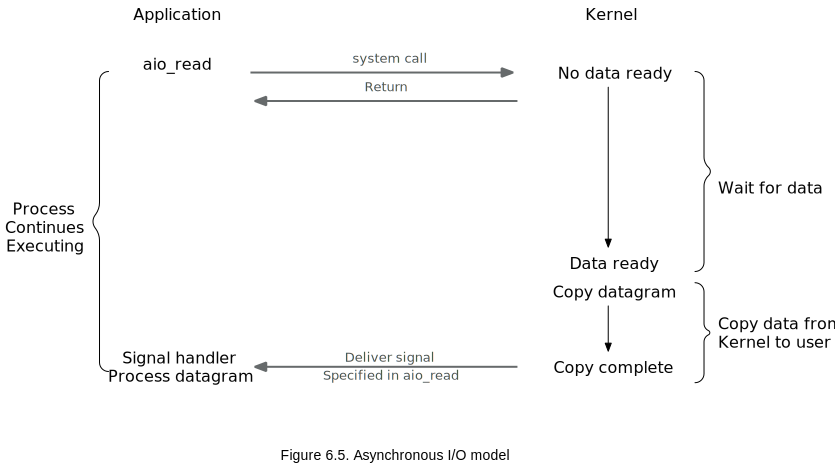

# Chapter 6. I/O Multiplexing: The 'select' and 'poll' Functions #

## 6.1 Introduction ##

- When a client is handling multiplexing descriptors, I/O multiplexing should be used.
- for a client to handle multiplex sockets at the same time. use `select`
- TCP server handles both a listening socket and its connected sockets, I/O multiplexing is normally used
- a server handles both TCP and UDP, I/O multiplexing is normally used
- a server handles multiple services and perhaps multiple protocols, I/O multiplexing is normally used 

## 6.2 I/O Models ##

- blocking I/O
- nonblocking I/O
- I/O multiplexing (`select` and `poll`)
- signal driven I/O (`SIGIO`)
- asynchronous I/O (the POSIX `aio_`functions)

### Blocking I/O Model ###

### Nonblocking I/O Model ###

### I/O Multiplexing Model ###

### Signal-Driven Model ###

### Asynchronous I/O Model ###

