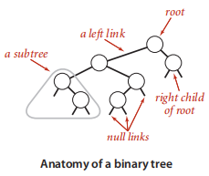
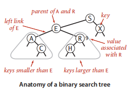
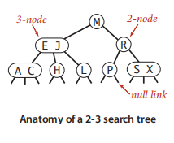

import {Tex} from 'react-tex'

# 第 3 章 查找 #

## 3.2 二叉查找树



> 定义：一棵二叉查找树(BST) 就是一棵二叉树，每个节点都含有一个可比较的键（以及相关联的值）且每个节点的键都大于左子树任意节点的键而小于右子树任意节点的键。

```c
struct BST {
    int key;
    int val;
    struct BST *left, *right;
    
    void (*init)(struct BST *node, int key, int val);
    int (*size)(struct BST *node);
    int (*get)(struct BST *node, int key);
    void (*put)(struct BST *node, int key, int val);
};
```


## 3.3 平衡查找树 ##

### 3.3.1 2-3 查找树 ###

> 一棵2-3查找树或为一棵空树，或由以下节点组成：
>
> - 2-node，含有一个键（及其对应的值）和两条链接，左链接指向的 2-3 树中的键都小于该节点，右链接指向的2-3树中的键都大于该节点
> - 3-node，含有两个键（及其对应的值）和三条链接，左链接指向的2-3树中的键都泪地该节点，右链接指向的2-3树中的键都大于该节点，中链接指向的2-3树中的键都位于该节点的两个键之间，右链接指向的2-3树中的键都大于该节点。

<div style={{textAlign:'center'}}>


</div>

一个完美平衡的 2-3 查找树中的所有空链接到根节点的距离都应该是相同的。

#### 3.3.1.1 查找 ####

具体查找过程



#### 3.3.1.2 向2-node中插入新键 ####

为了保证树的完美平衡性，不使用先进行未命中的查找后把新节点挂在树的底部的方式。

如果未命中的查找结束于一个 2-node，把这个 2-node替换成 3-node即可.

<div style={{textAlign:'center'}}>


</div>

#### 3.3.1.3 向一棵只含有一个 3-node的树中插入新键 ####

临时成为 4-node, 再行分解为 2-3 树 ，此时为中键创建新节点

<div style={{textAlign:'center'}}>


</div>

#### 3.3.1.4 向一个父节点为 2-node的 3-node中插入新键 ####

临时成为 4-node，下一步不再为中键创建新节点，而是将中键移至原来的父节点，为右键创建子节点。

<div style={{textAlign:'center'}}>


</div>

#### 3.3.1.5 向一个父节点为 3-node的 3-node中插入新键 ####

临时构造 4-node，将中键插入父节点，但父节点此时也会被构造为 4-node, 进一步向上将这个4-node中键移至它的父节点。重复这一过程直到遇到 2-node 可以添加变换后 4-node 中键。

<div style={{textAlign:'center'}}>


</div>

#### 3.3.1.6 分解根节点 ####

如果　3.3.1.5 从插入节点到根节点的路径上全是 3-node, 根节点最终会变成一个临时的 4-node。此时可以按照向一棵只有一个 3-node 的树中插入新键的方法来处理。最终树高加1，保持完美平衡性。

<div style={{textAlign:'center'}}>


</div>

#### 3.3.1.7 局部变换 ####

将一个 4-node 分解为 2-3 树的 6 种情况。每次都将子节点的中键移至父节点

<div style={{textAlign:'center'}}>


</div>

#### 3.3.1.8 全局性质 ####

局部变换不会影响树的全局有序性和平衡性: 任意空链接到根节点的路径长度都是相等的。

<div style={{textAlign:'center'}}>


</div>


### 3.3.2 红黑二叉查找树 ###

#### 3.3.2.1 替换 3-node ####

基本思想是用标准的二叉查找树（完全由2-node构成）和一些额外的信息（替换3-node）来表示2-3树。

树中的链接分为两种类型：红链接将两个 2-node 连接起来构成一个 3-node，黑链接则是2-3树中的普通链接。


#### 3.3.2.2 一种等价的定义 ####

> - 红链接均为左链接
> - 没有任何一个节点同时和两条红链接相连
> - **该树是完美黑色平衡的**，即任意空链接到根节点的路径上的黑链接数量相同

#### 3.3.2.3 一一对应 ####

> 将一棵红黑树中的红链接画平，所有的空链接到根节点的距离都将是相同的。如果我们将由红链接相连的节点合并，得到的就是一棵 2-3 树。

<div style={{textAlign:'center'}}>


</div>

#### 3.3.2.4 顔色表示 ####

<div style={{textAlign:'center'}}>

</div>


```c
typedef enum { BLACK = 0, RED = 1 } boolean;

struct node {
	int	     key;
	int	     val;
	struct node *left, *right;
	int	     N;
	boolean	     color;
};

void __init_node(struct node *p, int N, boolean color)
{
	if (!p) {
		return;
	}

	p->key = key;
	p->N = N;
	p->color = color;
	p->left = NULL;
	p->right = NULL;
}

boolean is_red(struct node *n) { return n && n->color == RED; }
```

#### 3.3.2.5 旋转 ####

将两个键中的较小者作为根节点变为将较大者作为根节点

```c
struct node *rotate_left(struct node *h)
{
	struct node *x = h->right;
	h->right = x->left;
	x->left = h;
	x->color = h->color;
	h->color = RED;
	x->N = h->N;
	h->N = 1 + size(h->left) + size(h->right);
	return x;
}

struct node *rotate_right(struct node *h)
{
	struct node *x = h->left;
	h->left = x->right;
	x->left = h;
	x->color = h->color;
	h->color = RED;
	x->N = h->N;
	h->N = 1 + size(h->left) + size(h->right);
	return x;
}
```

<div style={{textAlign:'center'}}>

<table>
<tr><td>  </td><td/><td>  </td> </tr>
<tr><td> 图 3.3.16 左旋转 h 的右链接 </td><td/><td> 图 3.3.17 右旋转 h 的左链接 </td> </tr>
</table>

</div>

#### 3.3.2.6 在旋转后重置父结点的链接 ####

旋转后返回一条链接，用来重置父结点中相应的链接。

#### 3.3.2.7 向单个 2-node 中插入新键 ####

插入后立即旋转。如果新键小于老键，添加一个红节点即可。若新键大于老键，新增的红结点会产生一条红色右链接。需要使用 `root=rotate_left(root)`旋转为红色左链接并修正根结点的链接。

<div style={{textAlign:'center'}}>


</div>

#### 3.3.2.8 向树底部的 2-node 插入新键 ####

用红链接将新节点和父节点相连。如果父节点是 2-node，则上述方法适用。

#### 3.3.2.9 向一棵双键树（即一个 3-node）中插入新键 ####

- 新键大于原树中的两个键，被连接到右链接。此时树平衡，无须操作
- 新键小于原树中的两个键，被连接到最左边的空链接。最上层的红链接右旋转
- 新键介于两者之间，先最下层的左旋转再将上层的右旋转

<div style={{textAlign:'center'}}>


</div>


#### 3.3.2.10 颜色转换 ####

#### 3.3.2.11 根节点总是黑色 ####

#### 3.3.2.12 向树底部的 3-node 插入新键 ####

### 3.3.3 实现 ###

内核源码 `lib/rbtree.c`

### 3.3.5 红黑树的性质 ###

> 研究红黑树的性质就是要检查对应的 2-3 树并对相应的 2-3 树进行分析的过程。

## 3.4 散列表

### 3.4.1 散列函数

将键转化为数组的索引 。如果键是一个字符串，就需要转化为一个数；如果键含有多个部分，就需要用某种方法将这些部分结合起来。

#### 3.4.1.8 自定义的`hashCode()`方法

散列表的用例希望`hashCode()`方法能够将键平均地散布为所有可能的32位整数。

#### 3.4.1.9 软缓存

如果散列值的计算很耗时，可以将每个键的散列值缓存起来。

### 3.4.2 基于拉链法的散列表(*链表*)

碰撞处理：处理两个或多个键的散列值相同的情况。

直接的办法是将大小为$M$的数组中每个元素指向一条链表，称为_拉链法_。

### 3.4.3 基于线性探测法的散列表（*数组*）

用大小为$M$的数组保存$N$个键值对，其中$M>N$。依靠数组中的__空位__解决碰撞冲突。称为 **开放地址**散列表。

*线性探测法*：当碰撞发生时，直接检查散列表的下一个位置（将索引值 加1）。这样的线性探测可能会产生三种结果：

- 命中
- 未命中
- 继续查找 

核心思想是：**与其将内存用作链表，不如将它们作为在散列表的空元素。**

#### 3.4.3.1 删除操作

需要将簇中被删除键的位置的右侧的所有键重新插入散列表。

```java
public void delete(Key key)
{
    if (!contain(key)) return;
    int i = hash(key);
    while (!key.equals(keys[i]))
        i = (i + 1) % M;
    keys[i] = null;
    vals[i] = null;
    i = (i + 1) % M;
    while(keys[i] != null)
    {
        Key keyToRedo = keys[i];
        Value valToRedo = vals[i];
        keys[i] = null;
        vals[i] = null;
        N--;
        put(keyToRedo, valToRedo);
        i = (i + 1) % M;
    }
    N--;
    if (N > 0 && N == M/8) resize(M/2);
}
```

#### 3.4.3.2 键簇

平均成本取决于元素在插入数组后聚集成的一组连续的条目，称*键簇*。

### 3.4.5 内存使用

| 方法                 | _N_个元素所需的内存（引用类型）        |
| -------------------- | -------------------------------------- |
| 基于拉链法的散列表   | <Tex texContent="~48N+32M"/>           |
| 基于线性探测的散列表 | <Tex texContent="在 ~32N和~128N之间"/> |
| 各种二叉树           | <Tex texContent="~56N"/>               |
