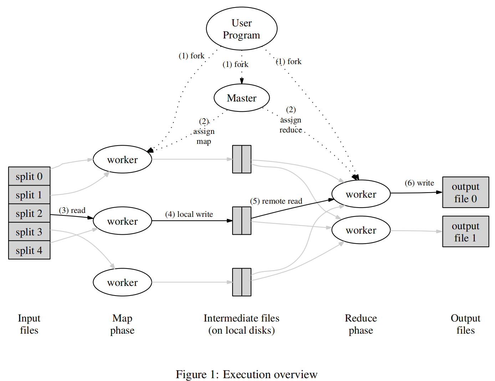

# MapReduce: Simplified Data Processing on Large Clusters

## Abstract

a programming model and an associated implementation for processing and generating large data sets.

- _map_ function processes a key/value pair to generate a set of intermediate key/value pairs,

- _reduce_ function merges all intermediate values associated with the same intermediate key.

## 2 Programming Model



### 2.1 Example

pseudo-code:

```
map(String key, String value):
 // key: document name
 // value: document contents
for each word w in value:
 EmitIntermediate(w, "1");

reduce(String key, Iterator values):
 // key: a word
 // values: a list of counts
 int result = 0;
 for each v in values:
  result += ParseInt(v);
 Emit(AsString(result));
```

### 2.2 Types

map (k1, v1) ----> list (k2, v2)

reduce (k2, list(v2)) ----> list(v2)

## 3 Implementation

## 3.1Execution Overview

1. split into pieces
2. master picks idle workers and assigns tasks
3. assigned worker reads input split.
4. partitioned into _R_ regions and write buffered pairs to local disk periodically.
5. a reduce worker uses RPC to read buffered data from the local disks of the map workers
6. reduce worker iterates over, append the output of the _Reduce_ function to a final output file for this reduce partition.
7. the master wakes up the user program after workers completed.

### 3.2 Master Data Structures

for each map task and reduce task: state (_idle_, _in-progress_ or _completed_), and the identity of the worker machine (for non-idle tasks)

for each completed map task: the locations and sizes of the _R_ intermediate file regions produced by the map task

### 3.3. Fault Tolerance

#### Worker Failure

The master pings every worker periodically.

Completed map tasks are re-executed on a failure because their output is stored on the local disks of the failed machine that is therefore inaccessible. Completed reduce tasks stored their output in a global file system.

When a map task is executed twice or more, all worker executing reduce tasks are notified of the re-execution. Any reduce task that has not already read will read the data from later machine.

#### Master Failure

make the master write periodic checkpoints, when it dies, started from the last checkpointed state.

#### Semantics in the Presence of Failures

when _map_ and _reduce_ operator are **deterministic** functions of input values, distributed implementation produces the **same** output.

We rely on atomic commits of map and reduce task outputs to achieve non-faulting sequential execution of the entire program.

Each in-process task writes its output to private temporary files.

The reduce worker atomically renames its temporary output file to the final output file when a reduce task completes.

### 3.4 Locality

## 4. Refinements

### 4.3 Combiner Function

> The only difference between a reduce function and a combiner function is how the MapReduce library handles the output of the function.
