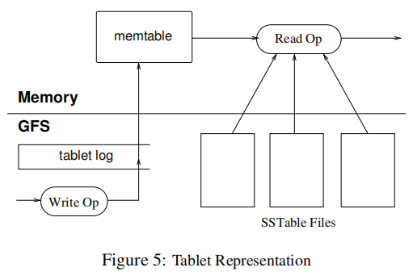

# Bigtable: A Distributed Storage System for Structured Data

## 2 Data Model

A Bigtable is spare, distributed, persistent multiple-dimentional sorted map.

- **Rows**

The rows keys in a table are arbitary strings (currently up to 64KB in size). Every read or write of data under a single row key is **atomic**.

Bigtable maintains data in lexicographic order by row key.

- **Column Families**

Column keys are grouped into sets called *calumn families*, which form the basic nit of access control.

A column key is named using the following syntax: *family:qualifiers*. Column family names must be printable, but qualifiers may be arbitrary strings.

- **Timestamps**

Each cell in a Bigtab le can contain multiple versions of the same data;  indexed by timestamp, 64-bit integers. unique.

## 4 Building Blocks

Bigtable uses the distributed Google File System (GFS) to store log and data files.  operates in a shared pool of machines. depends on a cluster management system for scheduling.

The Google *SSTable* file format is used internally to store Bigtable data.

Big table relies on a highly-available and persistent distributed lock service called Chubby. consists of five active replicas,

Bigtable uses Chubby: to ensure that there is at most one active master at any time; to store the bootstrap location of Bigtable data; to discvoer tablet servers and finalize tablet server deaths; to store Bigtable schema information; and to access control lists.# 5 Implementation

three major components: a library that is linked into every client, one master servaer, and many tablet servers.

## 5 Implementation

### 5.1 Tablet Location

 

The *root tablet* contains the location of all tablets in a special `METADATA` table.

Each `METADATA` row stores approximately 1KB of data in memory.

### 5.2 Tablet Assignment

**Each tablet is assigned to one tablet server at a time.**

1. The master grabs a unique *master* lock in Chubby, which prevents concurrent master instantiations.
2. The master scans the servers directory in Chubby to find the live servers.
3. The master communicates with every live tablet server to discover what tables are already assigned to each server.
4. The master scans the `METADATA` table to learn that is not already assigned, the master adds the table to the set of unassigned tablets, which makes the tablet eligible for tablet assignment.

### 5.3 Tablet Serving

### 5.4 Compactions

When the memtable size reaches a threshold, the memtable is frozen, a new memtable is created, and the frozen memtable is converted to an SSTable and written to GFS.

*minor compaction* goals:

- shrinks the memory usage of the tablet server
- reduces the amount of data that has to be read from the commit log during recovery if this server dies.