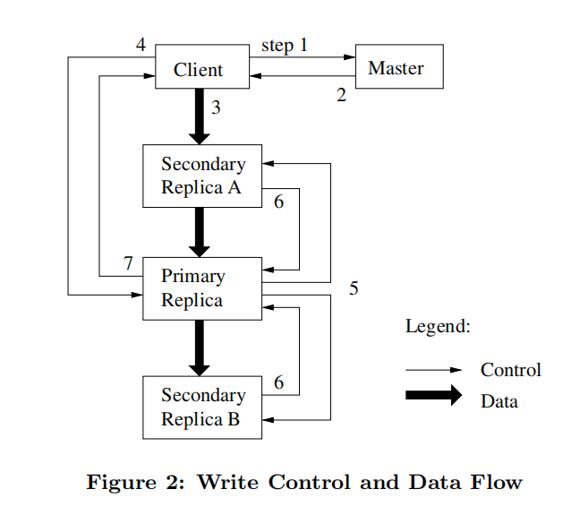

# The Google File System

## 2. DESIGN OVERVIEW

### 2.3 Architecture

### 

###  2.6 Metadata

- the file and chunk namespaces
- the mapping from files to chunks 
- the locations of each chunk's replicas# 3. SYSTEM INTERACTIONS

## 3. SYSTEM INTERACTIONS

### 3.1 Leases and Mutation Order

1. The client ask for server holds the current lease for the chunk and the locations of the other replicas.
1. The master replies with the identity of the primary and the locations of the other replicas.
1. The client pushes the data to all the replicas.
1. Once all the replicas have acknowledged receiving the data, the client sends a write request to the primary.
1. The primary forwards the write request to all secondary replicas.
1. The secondaries all reply to the primary indicating that they have completed the operation.
1. The primary replies to the client.

### 3.3 Atomic Record Appends

GFS appends it to the file at least once atomically (i.e., as one continuous sequence of bytes) at an offset of GFS's choosing and returns that offset to the client.

### 3.4 Snapshot

The snapshot operation makes a copy of a file or a directory tree almost instantaneously, while minimizing any interruptions of ongoing mutations.

# 4. MASTER OPERATION

### 4.1 Namespace Management and Locking

GFS logically represents its namespace as a lookup table mapping full pathnames to metadata.

Each master operation acquires a set of locks before it runs.

multiple file creations can be executed concurrently in the same director: each acquires **a read lock on the directory name** and **a write lock on the file name**.

### 4.2 Replica Placement

The chunk replica placement policy serves two purposes: maximize data reliability and availability, and maximize network bandwidth utilization.

### 4.3 Creation, Re-replication, Rebalancing

master considers:

1. place new replicas on chunkservers with below-average disk space utilization.
2. limit the number of "recent" creations on each chunkserver.
3. spread replicas of a chunk across racks.

### 4.4 Garbage Collection

GFS dose not immediately reclaim the available physical storage after a file is deleted

#### 4.4.1 Mechanism

the file is deleted is just renamed to a hidden name that includes the deletion timestamp. The master removes any such hidden files existed for specified times during the master's regular scan of the file system.

### 4.5 Stale Replica Detection

the master maintains a *chunk version number* to distinguish between up-to-date and stale replicas.

The master removes stale replicas in its regular garbage collection.

## 5. FAULT TOLERANCE AND DIAGNOSIS

### 5.1 High Availability

#### 5.1.1 Fast Recovery

Both the master and the chunkserver are designed to restore their state and start in seconds no matter how they terminated.

#### 5.1.2 Chunk Replication

each chunk is replicated on multiple chunkservers on different racks.

#### 5.1.3 Master Replication

Its operation log and checkpoints are replicated on multiple machines.

### 5.2 Data Integrity

