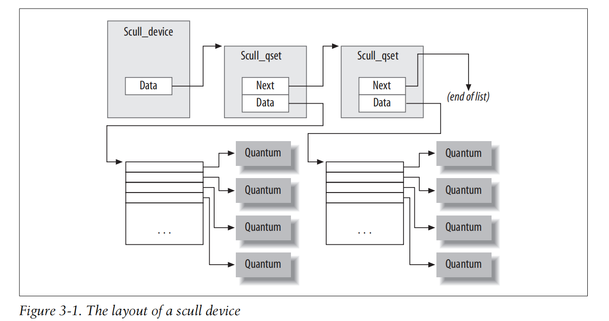
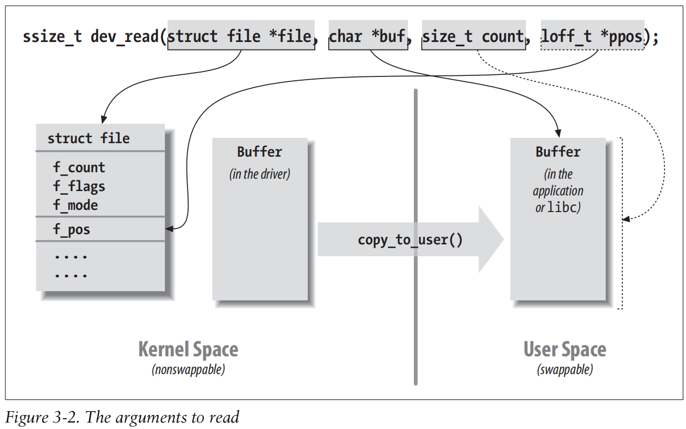

# 第三章 字符设备驱动程序[^1]

代码位置：[ldd3/scull at main · Zefrain/ldd3 (github.com)](https://github.com/Zefrain/ldd3/tree/main/scull)

## scull 的设计

编写驱动程序的第一步就是定义驱动程序为用户程序提供的能力（机制）。

## 主设备号和次设备号

- 主设备号标识设备对应的驱动程序
- 次设备号由内核使用，用于正确确定设备文件所指的设备。

`ls -l`第 5 列为主设备号，第6列为次设备号。

## 设备编号的内部表达

dev_t是一个32位整型，其中12位表示主设备号，其余20位表示次设备号。

```c
typedef u_long dev_t;

#define MINORBITS 20
#define MINORMASK ((1U << MINORBITS) - 1)

#define MAJOR(dev) ((unsigned int) ((dev) >> MINORBITS))
#define MINOR(dev) ((unsigned int) ((dev) & MINORMASK))
#define MKDEV(ma,mi) (((ma) << MINORBITS) | (mi))
```

## 分配和释放设备编号

头文件在`<linux/fs.h>`，实现在`fs/char_dev.c`

```c
int register_chrdev_region(dev_t from, unsigned count, const char *name);
void unregister_chrdev_region(dev_t from, unsigned count);
```

## 一些重要的数据结构

### 文件操作`<linux/fs.h>`

```c
struct file_operations {
 struct module *owner; /* THIS_MODULE defined in <linux/module.h> */
 loff_t (*llseek) (struct file *, loff_t, int);
 ssize_t (*read) (struct file *, char __user *, size_t, loff_t *);
 ssize_t (*write) (struct file *, const char __user *, size_t, loff_t *);
 ssize_t (*aio_read) (struct kiocb *, const struct iovec *, unsigned long, loff_t);
 ssize_t (*aio_write) (struct kiocb *, const struct iovec *, unsigned long, loff_t);
 int (*readdir) (struct file *, void *, filldir_t);
 unsigned int (*poll) (struct file *, struct poll_table_struct *);
 int (*ioctl) (struct inode *, struct file *, unsigned int, unsigned long);
 long (*unlocked_ioctl) (struct file *, unsigned int, unsigned long);
 long (*compat_ioctl) (struct file *, unsigned int, unsigned long);
 int (*mmap) (struct file *, struct vm_area_struct *);
 int (*open) (struct inode *, struct file *);
 int (*flush) (struct file *, fl_owner_t id);
 int (*release) (struct inode *, struct file *);
 int (*fsync) (struct file *, struct dentry *, int datasync);
 int (*aio_fsync) (struct kiocb *, int datasync);
 int (*fasync) (int, struct file *, int);
 int (*lock) (struct file *, int, struct file_lock *);
 ssize_t (*sendpage) (struct file *, struct page *, int, size_t, loff_t *, int);
 unsigned long (*get_unmapped_area)(struct file *, unsigned long, unsigned long, unsigned long, unsigned long);
 int (*check_flags)(int);
 int (*flock) (struct file *, int, struct file_lock *);
 ssize_t (*splice_write)(struct pipe_inode_info *, struct file *, loff_t *, size_t, unsigned int);
 ssize_t (*splice_read)(struct file *, loff_t *, struct pipe_inode_info *, size_t, unsigned int);
 int (*setlease)(struct file *, long, struct file_lock **);
};
```

**标记化的初始化方法允许 对结构成员进行重新排列。在某些场合下，将频繁被访问的成员放在相同的硬件缓存行上，将大大提高性能。**

### file 结构 `<linux/fs.h>`

最重要的成员：

```c
fmode_t                       f_mode;       // 文件模式
loff_t                        f_pos;        // 当前的读/写位置
unsigned int                  f_flags;      // 文件标志，如 R_RDONLY, O_NONBLOCK, O_SYNC
const struct file_operations *f_op;         // 文件操作结构体指针
void                         *private_data; // 驱动 程序可以用这个字段指向已分配的数据，但必须在内核销毁file结构前释放
struct dentry                *f_dentry;     // 文件cfyi
```

### inode 结构 `<linux/fs.h>`

有用的字段：

```c
dev_t        i_rdev;            // 包含了真正的设备编号
struct cdev *i_cdev;            // 包含了指向struct cdev 结构的指针
```

## 字符设备的注册 `<linux/cdev.h>`

`cdev_init`用来初始化已分配的结构

```c
/**
 * cdev_init() - initialize a cdev structure
 * @cdev: the structure to initialize
 * @fops: the file_operations for this device
 *
 * Initializes @cdev, remembering @fops, making it ready to add to the
 * system with cdev_add().
 */

void cdev_init(struct cdev *cdev, struct file_operations *fops);
```

`cdev_add`用来告知内核

```c
/**
 * cdev_add() - add a char device to the system
 * @p: the cdev structure for the device
 * @dev: the first device number for which this device is responsible
 * @count: the number of consecutive minor numbers corresponding to this
 *         device
 *
 * cdev_add() adds the device represented by @p to the system, making it
 * live immediately.  A negative error code is returned on failure.
 */
int cdev_add(struct cdev *dev, dev_t num, unsigned int count);
```

## open 和 release

### open 方法

*open*应完成的工作：

- 检查设备特定的错误（如设备未就绪或类似的硬件问题）
- 如果设备首次打开，则对其初始化
- 如有必要，更新 `f_op`指针
- 分配并填写置于 `filp->private_data`里的数据结构

### release 方法

- 释放 *open*方法为 `filp->private_data` 分配的数据
- 在最后一次关闭操作时关闭设备

## scull 的内存使用



## read 和 write 方法

- 在内核模式中运行时，用户空间的指针可能是无效的。
- 即使该指针在内核空间中代表相同的东西，但用户空间的内存是分页的，而在系统调用被调用时，涉及到的内存可能根本就不在RAM中。
- 指针可能由用户程序提供，盲目引用用户提供的的指针将导致系统打开后门，从而允许用户空间程序随意访问或覆盖系统中的内存。



[^1]: [ldd3/scull at main · Zefrain/ldd3 (github.com)](https://github.com/Zefrain/ldd3/tree/main/scull)
