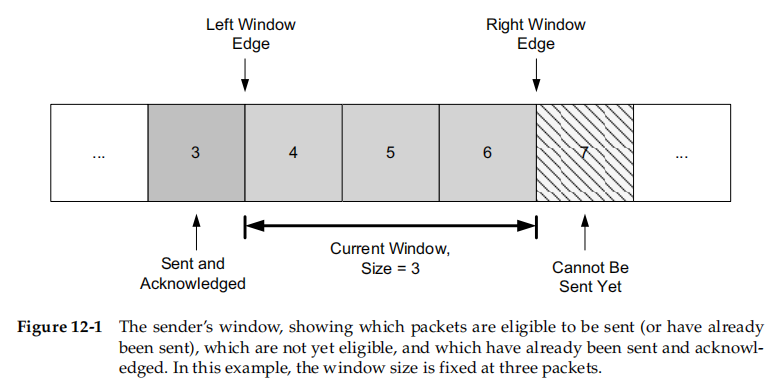
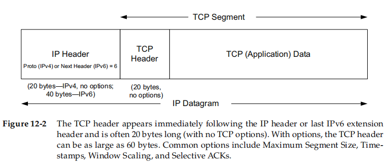
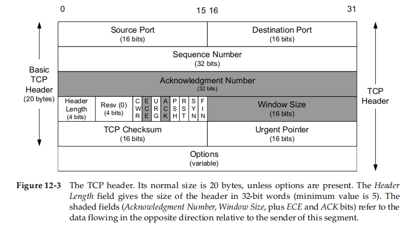

# Chapter 12. TCP: The Transmission Control Protocol (Preliminaries) #

## 12.1 Introduction

### 12.1.1 ARQ and Retransmission

*resend* for dealing with packets drops. requires a way to determine:

1. whether the receiver has received the packet
2. whether the packet it received was the same one the sender sent.

**Questions**:

1. How long should the sender wait for an ACK?

Chapter 14

2. What if the ACK is lost?

sends the packet again,

3. What if the packet was received but had errors in it?

Section 12.1

### 12.1.2 Windows of Packets and Sliding Windows

- Reference: [TCP Send Window, Receive Window, and How it Works | by Carson | Medium](https://cabulous.medium.com/tcp-send-window-receive-window-and-how-it-works-8629a4fad9ec)

 

## 12.3 TCP Header and Encapsulation ##

- _Seq Number_: the first byte of data in the containing segment represents. (to cope with the *duplicate* packets)
- _ACK Number_: The next sequence number that the sender of the ACK expects to receive. (the sequence number of the last successfully received byte of data plus 1 -- check packet state). 
