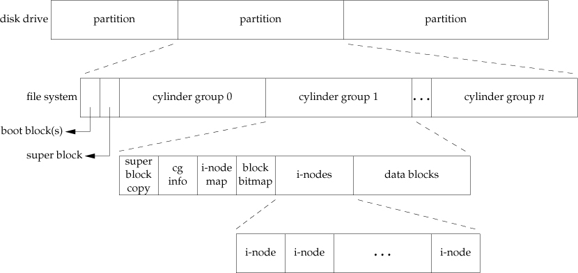
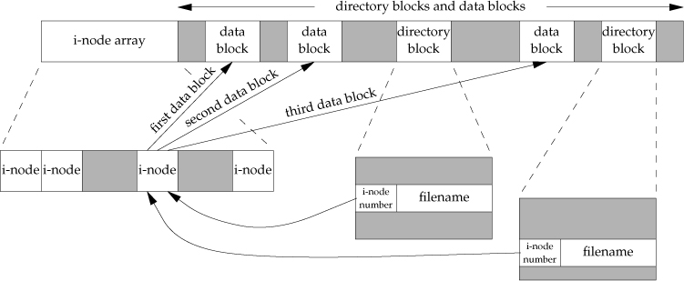
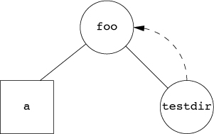

# Chapter 4. Fiiles and Directories #

## 4.14 File Systems ##

The i-nodes are fixed-length entries that contain most of the information about a file.

<div style={{textAlign:'center'}}>

_Figure 4.13 Disk drive, partitions, and a file system_
</div>

<br/>
<br/>
<br/>
<br/>
<br/>

The i-node and data block portion of a cylinder group in more detail.
<div style={{textAlign:'center'}}>


_Figure 4.14 Cylinder group's i-node and data blocks in more detail_
</div>

Note points:
- Two directory entries point to the same entry. Every i-node has a _link count_ that contains the number of directory entries that point to it. Only when the link count goes to __0__ can the file be deleted
- The other type of link is called a _symbolic link_. the actual contents of the file--the data blocks--store the name of the file that the symbolic link points to.
- The i-node contains all the information about the file.
<br/>
<br/>
<br/>
```sh
$ mkdir testdir
```

<div style={{textAlign:'center'}}>


_Figure 4.15 Sample cylinder group after creating the directory testdir_
</div>


## 4.17 Symbolic Links ##

- Hard links normally require that the link and the file reside in the same file system
- Only the superuser can create a hardlink to a directory (when supported by the underlying file system)

<br/>
<br/>
<div style={{textAlign:'center'}}>


_Figure 4.18 Symbolic link testdir that creates a loop_
</div>
