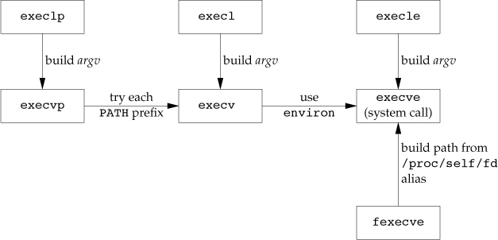

# Chapter 8. Process Control

## 8.1 Introduction

## 8.2 Process Identifiers

- PID 0: the scheduler process, is often known as the _swapper_. no program on disk corresponds to this process, is part of the kernel and is known as a system process,
- PID 1: _init_, is invoked by the kernel at the end of the bootstrap procedure. be responsible for bringing up a UNIX system after the kernel has been bootstraped.

## 8.3 `fork` Function

### File Sharing

<div style={{textAlign:'center'}}>


</div>

## 8.4 `vfork` Function

**`vfork` guarantees that the child runs first, until the child calls `exec` or `exit`.**

`_exit` does not perform any flushing of standard I/O buffers.

## 8.10 `exec` Functions

```c

#include <unistd.h>

extern char **environ;

int execl(const char *path, const char *arg0, ..., /*, (char *)0, */);

int execle(const char *path, const char *arg0, ..., /* (char *)0 char *const envp[] */);

int execlp(const char *file, const char *arg0, ..., /*, (char *)0, */);

int execv(const char *path, char *const argv[]);

int execvp(const char *file, char *const argv[]);

int execvP(const char *file, const char *search_path, char *const argv[]);
```

The first difference in these functions is that the first four take a pathname argument,
the next two take a filename argument, and the last one takes a file descriptor argument.
When a _filename_ argument is specified,

- If _filename_ contains a slah, it is taken as a pathname,
- Otherwise, the executable file is searched for in the directories specified by the PATH environment virable.

<div style={{textAlign:'center'}}>


_Figure 8.15 Relationship of the seven `exec` functions_

</div>

## 8.11 Changing User IDs and Group IDs

<div style={{textAlign:'center'}}>


_Figure 8.19 Summary of all the functions that set the various user IDs_

</div>

## 8.16 Process Scheduling

Lower nice have higher scheduling priority.
