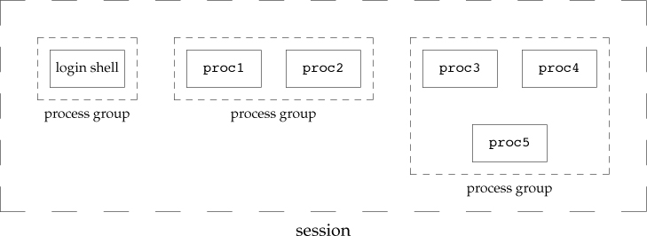
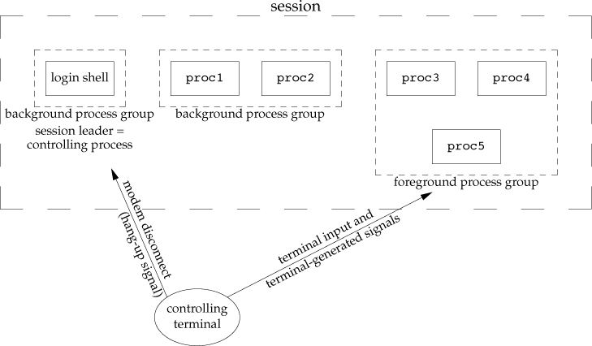
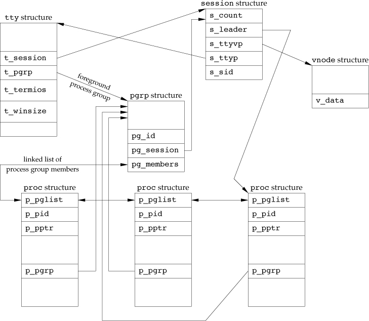

# Chapter 9. Process Relationships

## 9.3 Network Logins

With the terminal logins, `init` knows which terminal devices are enabled for logins and spawns a `getty` process for each device. We have a process waiting for each possible login.
With the network logins, all the logins come through the kernel's network interface drivers. We have to wait for a network connection request to arrive.

## 9.4 Process Groups

Each process belongs to a process group. A process group is a collection of one or more processes, usually associated with the same job

## 9.5 Sessions

A sessions is a collection of one or more process groups.

<div style={{textAlign:'center'}}>



_Figure 9.6 Arrangement of processes into process groups and sessions_

</div>

```c

#include <unistd.h>

/*
 * return process group ID if OK, -1 on error
 */
pid_t setsid(void);

/*
 * return session leader's process group ID if OK, -1 on error
 */
pid_t getsid(pid_t pid);
```

1. The process becomes _session leader_ of this new session. ( \__A session leader is the process that creates a session_)
2. The process becomes the process group leader of a new process group.
3. The process has no controlling terminal. _If the process had a controlling terminal before calling `setsid` , that association is broken_.

## 9.6 Controlling Terminal

- A session can have a single _controlling terminal_.
- The session leader that establishes the connection to the controlling terminal is called the _calling process_.
- The process groups within a session can be divided into a single _foreground process group_ and one ore more _background process groups_.
- If a session has a controlling terminal, it has a single foreground process group and all other process groups in the session are background groups.
- Whenever we press the terminal's interrupt key, the interrupt signal is sent to all processes in the foreground process group.
- Whenever we press the terminal's quit key, the quit signal is sent to all processes in the foreground process group.
- If a modern (or network) disconnect is detected by the terminal interface, the hang-up signal is sent to the **_controlling process_**.

<div style={{textAlign:'center'}}>



_Figure 9.7 Process groups and sessions showing controlling terminal_

</div>

## 9.7 `tcgetpgrp`, `tcsetgrp`, and `tcgetsid` Functions

Tell the kernel which process group is the foreground process group,

if the process has a controlling terminal, the process can call `tcsetpgrp`
to set the foreground process group ID to _pgrpid_. The value of _pgrpid_
**must** be the process group ID of a process group in the **same** session,
and _fd_ **must** refer to the controlling terminal of the session.

```c

#include <unistd.h>

/*
 * return       process group ID of foreground process group if OK,
 *              -1 on error
 */
pid_t tcgetpgrp(int fd);

/*
 * return       0 if OK, -1 on error
 */
int tcsetpgrp(int fd, pid_t pgrpid);

/*
 * return       session leader's process group ID if OK,
 *              -1 on error
 */
pid_t tcgetsid(int fd);

```

## 9.8 Job Control

Job control allows us to start multiple jobs (groups of processes) from a single
terminal and to control which jobs can access the terminal and which jobs are
run in the background.

Requirements:

1. shell supports
2. terminal driver in the kernel supports
3. kernel must supports certain job-control signals.

<div style={{textAlign:'center'}}>


_Figure Summary of job control features with foreground and background jobs, and terminal driver_

</div>

## 9.10 Orphaned Process Groups

A process whose parent terminates is called an orphan and is inherited by the _init_ process.

### Example

<div style={{textAlign:'center'}}>


_Figure 9.11 Example of a process about to be orphaned_

</div>

## 9.11 FreeBSD Implementation

<div style={{textAlign:'center'}}>



_Figure 9.13 FreeBSD implementation of sessions and process groups_

</div>

session structure:

- s_count is the number of process groups in the session.
- s_leader is a pointer to the proc structure of the session leader.
- s_ttyvp is a pointer to the vnode structure of the controlling terminal.
- s_ttyp is a pointer to the ttyp structure of the controlling terminal.
- s_sid is the session ID.

tty structure:

- t_session points to the session structure that has this terminal as its controlling terminal.
- t_pgrp points to the pgrp structure of the foreground process group.
- t_termios is a structure containing all the special characters and related information for this kernel.
- t_winsize is a winsize structure that contains the current size of the terminal window.

process group:

- pg_id is the process group ID.
- pg_session points to the session strcutre for the session to which this process group belongs.
- pg_members is a pointer to the list of proc structures that are members of this process group.

proc structure for single process:

- p_pid contains the process ID.
- p_pptr is a pointer to the proc structure of the parent process.
- p_pgrp points to the pgrp structure of the process group to which this process belongs.
- p_pglist is a structure containing pointers to the next and previous processes in the process group.
