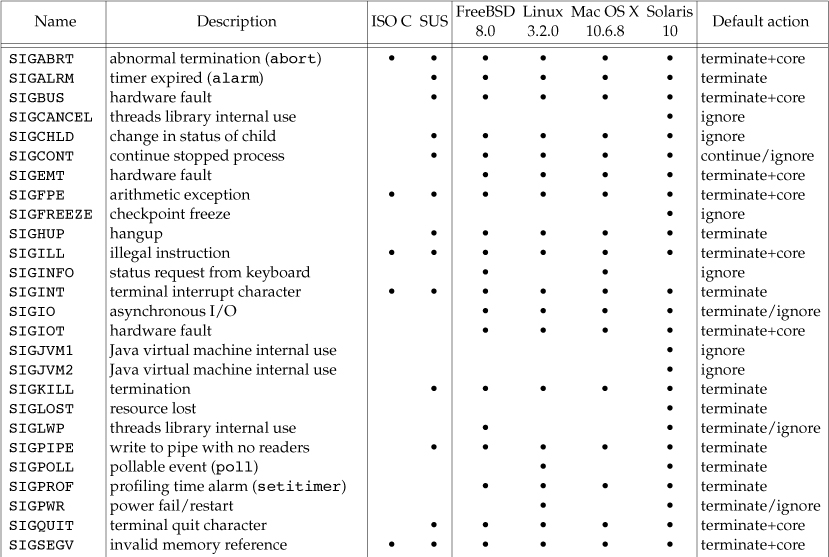

# Chapter 10. Signals

## 10.1 Introduction

**Signals provde a way of handling asynchronous events**

## 10.2 Signal Concepts

No signal has a signal number of 0.

Signals are classic examples of asynchronous events.

_Figure 10.1 UNIX System signals_

The core file will not be generated if :

- the process was set-user-ID and the current user is not the owner of the program file,
- the process was set-group-ID and the current user is not the group owner of the file,
- the user does not have permission to write in the current working directory,
- the file already exists and the user does not have permission to write to it,
- the file is too big (RLIMIT_CORE).

## 10.3 `signal` Function

we are not able to determine the current disposition of a signal without changing the disposition.

### Process Creation

When a process calls `fork`, the child inherits the parent's signal dispositions.
