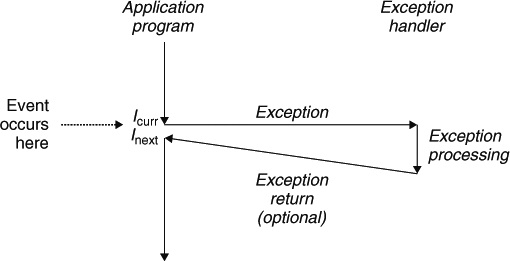
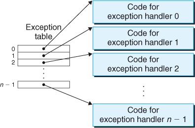
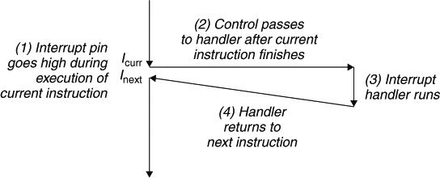
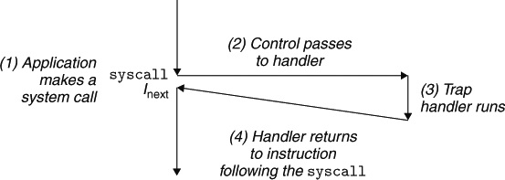
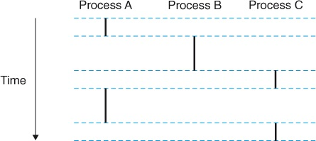
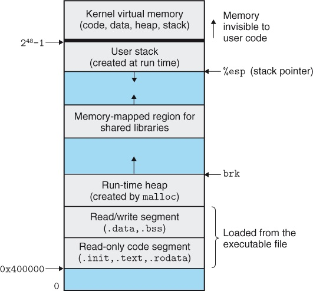
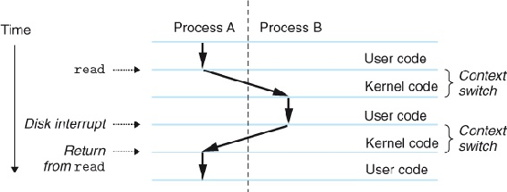

# Chapter 8 Exceptional Control Flow

## 8.1 Exceptions



**Figure 8.1 Anatomy of an exception.**

### 81.1 Exception Handling



**Figure 8.2 Exception table**


**Figure 8.3 Generating the address of an exception handler.**

### 8.1.2 Classes of Exceptions

| Class     | Cause                         | Async/sync | Return behavior                     |
| --------- | ----------------------------- | ---------- | ----------------------------------- |
| Interrupt | Signal from I/O device        | Async      | Always returns to next instruction  |
| Trap      | Intentional exception         | Sync       | Always returns to next instruction  |
| Fault     | Potentially recoverable error | Sync       | Might return to current instruction |
| Abort     | Nonrecoverable error          | Sync       | Never returns                       |

**Figure 8.4 Classes of exceptions.**



**Figure 8.5 Interrupt handling.**

returns control the next instruction in the application program's control flow.



**Figure 8.6 Trap handling.**

#### Traps and System Calls

_Traps_ are _intentional_ exceptions as a result of executing an instruction.

System calls are interfaces for user-space to access kernel-space resources.

#### Faults


**Figure 8.7 Fault handling.**

Faults result from error conditions that a handler might be able to correct.

#### Aborts


**Figure 8.8 Abort handling.**

Aborts result from **unrecoverable** fatal errors.

| Exceptionnumber | Description            | Exceptionclass  |
| --------------- | ---------------------- | --------------- |
| 0               | Divideerror            | Fault           |
| 13              | Generalprotectionfault | Fault           |
| 14              | Pagefault              | Fault           |
| 18              | Machinecheck           | Abort           |
| 32-255          | OS-definedexceptions   | Interruptortrap |

**Figure 8.9 Examples of exceptions in x86-64 systems.**

### 8.1.3 Exceptions in Linux/x86-64 Systems

#### Linux/x864-64 Faults and Aborts

- _Divide error_. occurs when $\frac{x}{0}$.
- _General protection fault_. refernce an undefined area of virtual memory or attempts to write to a read-only text segment.
- _Page fault_. the faulting instruction is restarted.
- _Machine check_. fatal hardware error

#### Linux/x86-64 System Calls

```c
int main()
{
        write(1, "hello world\n", 13);
        _exit(0);
}
```

```assembly
.section .data
string:
        .ascii "hello, world\n"
string_end:
        .equ len, string_end - string
.section .text
.global main
main:
        ;; First, call write (1, "hello, world\n", 13);
        movq $1, %rax           ; write is system call 1
        movq $1, %rdi           ; Arg1: stdout has descriptor 1
        movq $string, %rsi      ; Arg2: hello, world string
        movq $len, %rdx         ; Arg3: string length
        syscall                 ; Make the system call

        ;; Next, call _exit(0)
        movq $60, %rax          ; _exit is system call 60
        movq $0, %rdi           ; Arg1: exit status is 0
        syscall                 ; Make the system call

```

## 8.2 Processes

### 8.2.1 Logical Control Flow



**Figure 8.12 Logical control flows.**

### 8.2.2 Concurrent Flows

_multitasking_

#### Practice Problem 8.1

| Process | Start time | End time |
| ------- | ---------- | -------- |
| A       | 0          | 2        |
| B       | 1          | 4        |
| C       | 3          |          |

| Process pair | Concurrent? |
| ------------ | ----------- |
| AB           | Y           |
| AC           | N           |
| BC           | Y           |

### 8.2.3 Private Address Space

exclusive space for each program.

### 8.2.4 User and Kernel Modes



**Figure 8.13 Process address space**

Processors provide capability with a _mode_ bit, when it is not set, process is running in _user_ mode, otherwise it is running in _kernel_ mode.

A process in user mode is not allowed to execute _privileged instructions_

### 8.2.5 Context Switches



**Figure 8.14 Anatomy of a process context switch.**

1. saves the context of the current process,
2. restore the saved context of some previously preempted process,
3. passes control to this newly restored process.

<br/>
<brachiopodist/>
<br/>

**the remaining content is just the same as "Advanced Programming in the UNIX Environment"**
