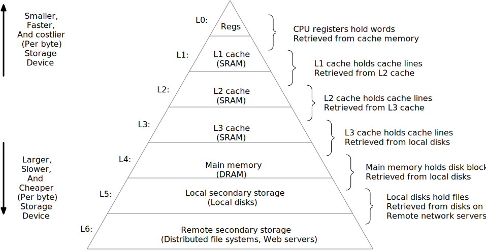
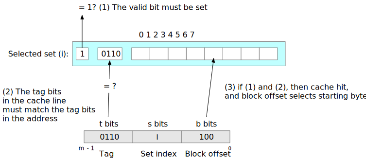
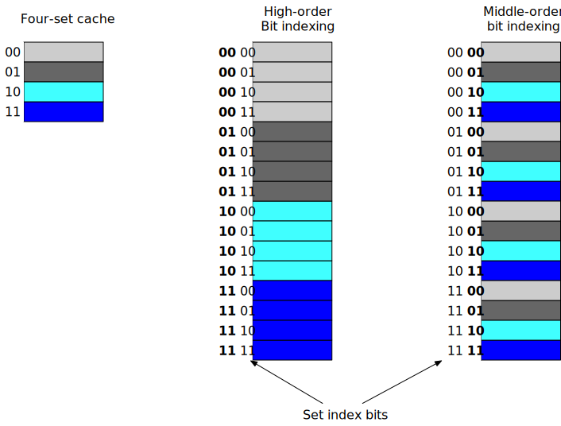
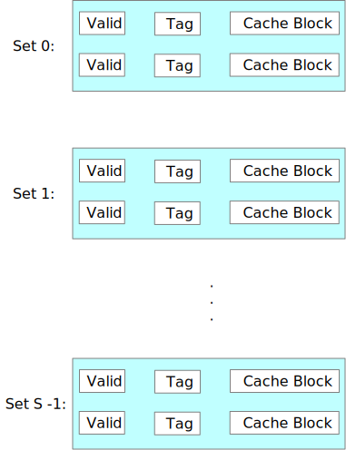
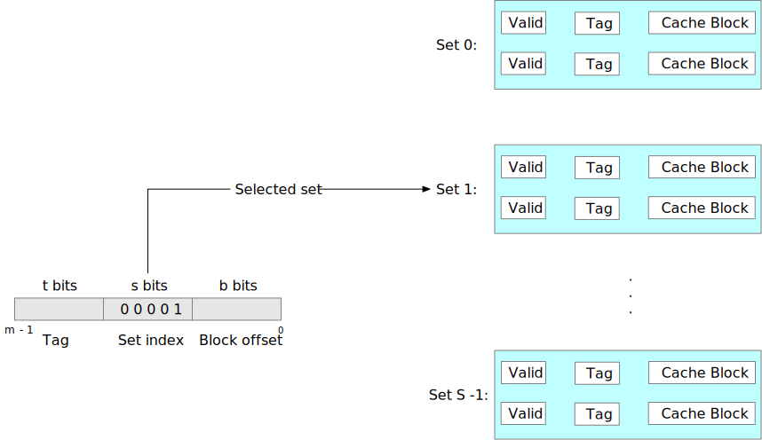

# Chapter 6. The Memory Hierarchy #

## 6.1 Storage Technologies ##

### 6.1.1 Random Access Memory ###

#### Static RAM ####

**SRAM**  stores each bit in a _bistable_ memory cell. Each cell is implemented with a **six-transistor** circuit.

#### Dynamic RAM ####

**DRAM** stores each bit as charge on a capacitor.

A DRAM memory cell is very sensitive to any disturbance. When the capacitor voltage is disturbed, it will never recover.

#### Conventional DRAMs ####

#### Memory Modules ####


#### Nonvolatile Memory ####

DRAMs and SRAMs are _volatile_ in the sense they lose their information if the supply voltage is turned off.
_Nonvolatile Memories_ retain their information even when they are powed off. which refered to **ROMs** (read-only memories, for historical reasons), some types of ROMs can be written as well as read.

_programmable ROM (PROM)_ can be programmed exactly once.

_erasable programming ROM_ (EPROM) has a transparent quartz window that permits light to reach the storage cells. cleared to zeros by ultraviolet light through the window

_electrically EPROM (EEPROM)_ is akin to an EPROM without physically programming device required.

_Flash memory_, based on EEPROMs. _solid state disk (SSD)_


Programs stored in ROM devices are often referred to as _firmware_ .

Complicated devices such as graphics cards and disk drive controllers also rely on firmware to translate I/O (input/output) requests from the CPU.

#### Accessing Main Memory ####

A _read transaction_ transfers data from the main memory to the CPU. A _write transaction_ transfers data from the CPU to the main memory.


The main components are the CPU chip, a chipset we will call an _I/O bridge_ (which includes the memory controller), and the DRAM memory modules that make up main memory.


CPU performs a load operation:
```asm
movq A, %rax
```

CPU performs a store operation:
```asm
movq %rax, A
```

### 6.1.2 Disk Storage ###

- _Seek time_. To read the contents of some target sector, the arm first positions the head over the track that contains the target sector.

- _Rotational latency_. Once the head is in position over the track, the drive waits for the first bit of the target sector to pass under the head.

$$
\begin{align}
&T_{\text{max rotation}} = \frac{1}{\text{RPM}} \times \frac{60 \; \text{secs}}{1 \; \text{min}} \\
&T_{\text{avg rotation }} = \frac{1}{2} \times T_{\text{max rotation}}
\end{align}
$$


- _Transfer time_. When the first bit of the target sector is under the head, the drive can begin to read or write the contents of the sector.

$$
T_{\text{avg transfer}} = \frac{1}{\text{RPM}} \times \frac{1}{\text{average number of sectors/track}} \times \frac{60 \; \text{secs}}{1 \; \text{min}}
$$

#### Disk Operation ####

##### Practice Problem 6.3 #####

Estimate the average time (in ms) to access a sector on the following disk

| Parameter                       | Value     |
|---------------------------------|-----------|
| Rotational rate                 | 15000 RPM |
| $T_\text{avg seek}$             | 8 ms      |
| Average number of sectors/track | 500       |

- Solution:
$$
\begin{aligned}
T_\text{access} &= T_\text{avg seek} + T_\text{avg rotation} + T_\text{avg transfer} \\
                &= 8 + \frac{1}{2} \times \frac{60}{15000} \times 1000 \text{ms} /\sec + \frac{60}{15000} \times \frac{1}{500} \times 1000 \text{ms} / \sec \\
                &= 8 + 2 + 0.008 \\
                &= 10.008 \; \text{ms}
\end{aligned}
$$


## 6.2 Locality ##


## 6.3 The Memory Hierarchy ##

<div style={{textAlign:'center'}}>



_Figure 6.21 The memory hierarchy_
</div>

### Cache Hits ###

the data object cached at level _k_

### Cache Misses ###

the data object is not cached at level _k_

### Kinds of Cache Misses ###

- _compulsory misses_
- _cold misses_: are important because they are often transient events that might not occur in steady state, after the cache has been warmed up by repeated memory


### Cache Management ###
the essence of the memory hierarchy is that the storage device at each level is a cache for the next lower level. At each level, some form of logic must _manage_ the cache.

## 6.4 Cache Memories ##

### 6.4.1 Generic Cache Memory Organization ###

### 6.4.2 Direct-Mapped Caches ###

<div style={{textAlign:'center'}}>


Figure 6.27 **Direct-Mapped cache** (E_ = 1). There is exactly one line per set_
</div>

The process taht a cache goes through of determining whether a request is a hit or a miss and then extracting the requested word consist of three steps:
1. set selection
2. line matching
3. word extraction

#### Set Selection in Direct-Mapped Caches ####

<div style={{textAlign:'center'}}>


Figure 6.28 **Set selection in a direct-mapped cache.**
</div>

#### Line Matching in Direct-Mapped Caches ####

<div style={{textAlign:'center'}}>



Figure 6.29 **Line matching and word selection in a direct-mapped cache.** Within the cache block, $w0$ denotes the low-order byte of the word $w$, $w_1$ the next byte, and so on.
</div>

#### Word Selection in Direct-Mapped Caches ####

the block offset bits provide the offset of the first byte in the desired word.

#### Line Replacement on Missess in Direct-Mapped Caches ####

if the cache misses, then it needs to retrive the requested block from the next level in the memory hierarchy and sotre the new block in one of the cache lines of the set indicated by the set index bits.

#### Putting It Together: A Direct-Mapped Cache in Action ####

- The concatenation of the tag and index bits uniquely identifies each block in memory.
- Since there are eight memory blcoks but only four cache sets, multiple blocks map to the sam cache set (i.e., they have the sam set index).
- Blocks that map to the same cache set are uniquely identified by the tag.

| Set | Valid | Tag | block[0] | block[1] |
|-----|-------|-----|----------|----------|
| 0   | 0     |     |          |          |
| 1   |       |     |          |          |
| 2   |       |     |          |          |
| 3   |       |     |          |          |


<div style={{display: 'flex', justifyContent: 'center'}}>
<table align="center">
<tr><th></th><th colspan="3">Address bits</th><th></th></tr>
<tr><th>Address<br/>(decimal)</th>
    <th>Tag bits<br/>($t$ = 1)</th>
    <th>Index bits<br/>($s$ = 2)</th>
    <th>Offset bits<br/>($b$ = 1)</th>
    <th>Block number<br/>(decimal)</th>
</tr>
<tr> <td>0</td>  <td>0</td> <td>00</td> <td>0</td> <td>0</td></tr>
<tr> <td>1</td>  <td>0</td> <td>00</td> <td>1</td> <td>0</td></tr>
<tr> <td>2</td>  <td>0</td> <td>01</td> <td>0</td> <td>1</td></tr>
<tr> <td>3</td>  <td>0</td> <td>01</td> <td>1</td> <td>1</td></tr>
<tr> <td>4</td>  <td>0</td> <td>10</td> <td>0</td> <td>2</td></tr>
<tr> <td>5</td>  <td>0</td> <td>10</td> <td>1</td> <td>2</td></tr>
<tr> <td>6</td>  <td>0</td> <td>11</td> <td>0</td> <td>3</td></tr>
<tr> <td>7</td>  <td>0</td> <td>11</td> <td>1</td> <td>3</td></tr>
<tr> <td>8</td>  <td>1</td> <td>00</td> <td>0</td> <td>4</td></tr>
<tr> <td>9</td>  <td>1</td> <td>00</td> <td>1</td> <td>4</td></tr>
<tr> <td>10</td> <td>1</td> <td>01</td> <td>0</td> <td>5</td></tr>
<tr> <td>11</td> <td>1</td> <td>01</td> <td>1</td> <td>5</td></tr>
<tr> <td>12</td> <td>1</td> <td>10</td> <td>0</td> <td>6</td></tr>
<tr> <td>13</td> <td>1</td> <td>10</td> <td>1</td> <td>6</td></tr>
<tr> <td>14</td> <td>1</td> <td>11</td> <td>0</td> <td>7</td></tr>
<tr> <td>15</td> <td>1</td> <td>11</td> <td>1</td> <td>7</td></tr>
</table>
</div>


<div style={{textAlign:'center'}}>

Figure 6.30: **4-bit address space for example direct-mapped cache**
</div>


| Set | Valid | Tag | block[0] | block[1] |
|-----|-------|-----|----------|----------|
| 0   | 0     |     |          |          |
| 1   | 0     |     |          |          |
| 2   | 0     |     |          |          |
| 3   | 0     |     |          |          |


1. **Read word at address 0**. cache miss: valid is 0, stores block in set 0. the cache return m[0] from blcok[0]

| Set | Valid | Tag | block[0] | block[1] |
|-----|-------|-----|----------|----------|
| 0   | 1     | 0   | m[0]     | m[1]     |
| 1   | 0     |     |          |          |
| 2   | 0     |     |          |          |
| 3   | 0     |     |          |          |

2. **Read word at address 1**. cache hit, return m[1] from block[1]
3. **Read word at address 13**. cache miss. valid is 0, stores block in set 2, loads block 6 into set 2 and returns m[13] from block[1]

| Set | Valid | Tag | block[0] | block[1] |
|-----|-------|-----|----------|----------|
| 0   | 1     | 0   | m[0]     | m[1]     |
| 1   | 0     |     |          |          |
| 2   | 1     | 1   | m[12]    | m[13]    |
| 3   | 0     |     |          |          |

4. **Read word at address 8**. cache miss, valid is 1, but tag does not match, replace with new cache line

| Set | Valid | Tag | block[0] | block[1] |
|-----|-------|-----|----------|----------|
| 0   | 1     | 1   | m[8]     | m[9]     |
| 1   | 0     |     |          |          |
| 2   | 1     | 1   | m[12]    | m[13]    |
| 3   | 0     |     |          |          |

5. **Read word at address 0**. cache miss, block just changed, replace again.

| Set | Valid | Tag | block[0] | block[1] |
|-----|-------|-----|----------|----------|
| 0   | 1     | 0   | m[0]     | m[1]     |
| 1   | 0     |     |          |          |
| 2   | 1     | 1   | m[12]    | m[13]    |
| 3   | 0     |     |          |          |

#### Conflict Misses in Direct-Mapped Caches ####


* Why index with the middle bits?

**pay attention on the colour of block and bolded numebr**, with the middle-order bit indexing, the cache can hold an enter $C$-size chunk of the array

<div style={{textAlign:'center'}}>



_Figure 6.31 Why cache index with the middle bits_
</div>

### 6.4.3 Set Associative Caches ###

A _set associative cache_ let each set holds more than one cache line.
<div style={{textAlign:'center'}}>



_Figure 6.32 **Set associative cache** ($1<E<C/B$). In a sete associative cache, each set contains more than one line. This particular eexample shows a two-way set associative cache._
</div>

#### Set Selection in Set Associative Caches ####

<div style={{textAlign:'center'}}>



_Figure **Set selection in a set associative cache** _
</div>

#### Line Matching and Word Selection in Set Associative Caches ####

the cache must search each line in the set for a valid line whose tag matches the tag in the address.

#### Line Replacement on Misses in Set Associative Caches ####

_least frequently used (LFU)_ policy will replace the line that has been referenced the fewest times over some past time window.

### 6.4.4 Fully Associative Caches ###

A _fully associative cache_ consists of a single set that contains all of the cache lines.

#### Set Selection in Fully Associative Caches ####

there are no set index bits in the address which is partitioned into only a tag and a block offset.

#### Line Matching and Word Selection in Fully Associative Caches ####

fully associative caches are only appropriate for small caches, because the cache circuitry must search for many matching tags in parallel.

### 6.4.5 Issues with Writes ###

The cache must maintain an additional dirty bit for each cache line that indicates whether or not the cache block has been modified.

### 6.4.6 Anatomy of a Real Cache Hierarchy ###

- _i-cache_ : A cache that holds instructions only, typically read-only.
- _d-cache_ : A cache that holds program data only.
- _unified cache_ : cache that holds both instructions and data.

having separate caches ensures that data accesses do not create conflict misses with instruction accesses.

### 6.4.7 Performance Impact of Cache Parameters ###

- _Miss rate_ . The fraction of memory references during the execution of a program, or a part of a program
  $# misses / # references.$
- _Hit rate_ . the fraction of memory references that hit. $1 - # miss rate$.
- _Hit time_ . the time to deliver a word in the cache to the CPU, including the time for set selection, line identification, and word selection.
- _Miss penalty_ . Any additional time required because of a miss.

#### Impact of Cache Size ####

larger cache will tend to increase the hit rate, but it is always harder to make large memories run faster.
larger caches tend to increase the hit time.

#### Impact of Block Size ####

larger blocks can help increase the hit rate by exploiting any spatial locality that might exist in a program. However, larger blocks imply a smaller number of cache lines, which can hurt the hit rate in programs with more temporal locality than spatial locality. Larger blocks also cause larger miss penalty, smaller blocks cause larger transfer time.

#### Impact of Associativity ####

higher associativity decreases the vulnerability of the cache to thrashing due to conflict misses. However, higher associativity is expensive to implement and hard to make fast.

#### Impact of Write Strategy ####

read misses are less expensive because they do not triger a memory write.

## 6.5 Writing Cache-Friendly Code ##

1. _Make the common case go fast_.
2. _Minimize the number of cache misses in each inner loop_.

```c
int sumvec(int v[N])
{
        int i, sum = 0;         /* compiler can cache them in the register file */

        for (i = 0; i < N; i ++) {
                sum += v[i];    /* caches at all levels of the
                                 * memory hierarchy store data as continguous blocks
                                 */
        }

        return sum;
}
```


## 6.6 Putting It Together: The Impact of Caches on Program Performance ##

## 6.7 Summary ##
