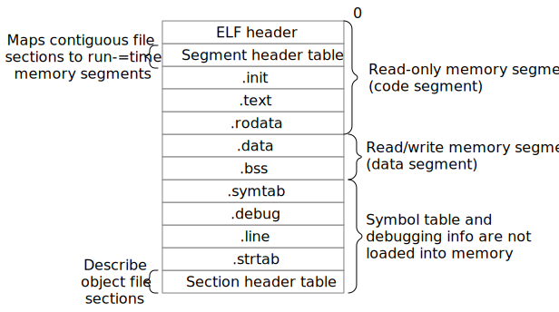
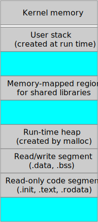

# Chapter 7 Linking #
## 7.1 Compiler Drivers ##

## 7.2 Static Linking ##

## 7.3 Object Files ##

<div style={{textAlign:'center'}}>


Figure 7.3 **Typical ELF relocatable object file**
</div>

## 7.4 Relocatable Object Files ##

 `.text` The machine code of the compiled program

 `.rodata` Read-only data

 `.data` _Initialized_ global and static C variables

 `.bss` (Better Save Space) _Unintialized_ global and static C variables

 `.symtab` A _symbol table_ with information about functions and global variables that are defined and referenced

 `.rel.text` A list of locations in the `.text` section that will need to be modified when the linker combines this object file with others.

 `.rel.data` Relocation information for any global variables that are referenced or defined

 `.debug` A debugging symbol table with entries for local variables and types

 `.line` A mapping between line numbers in the original C and machine code instructions in the `.text` section

 `.strtab` A string table for the symbol tables in the `.symtab` and `.debug` sections and for the section names in the section headers.


## 7.8 Executable Object Files ##

<div style={{textAlign:'center'}}>



Figure 7.13 **Typical ELF executable object file**
</div>


## 7.9 Loading Executable Object Files ##

<div style={{textAlign:'center'}}>



Figure 7.15 **Linux x86-64 run-time memory image.** Gaps due to segment alignment requirements and address-space layout randomization (ASLR) are note shown. Not to scale.
</div>

## 7.12 Position-Independent Code (PIC) ##

`gcc -fpic`


_Procedure linkage table (PLT)_. The PLT is an array of 16-byte code entries.
PLT[0] is a special entry that jumps into the dynamic linker. Each shared library function called by the execuable has its own PLT entry.
Entries starting at PLT[2] invoke functions called by the user code.

_Global offset table (GOT)_. The GOT is an array of 8-byte address entries. GOT[0] and GOT[1] contain information that the dynamic linker uses when it resolves function address. GOT[2] is the entry for the dynamic linker in the ld-linux.so module. GOT[4] and PLT[2] correspond to advec.


## 7.13 Library Interpositioning ##

allows you to intercept calls to shared library functions and execute your own code instead.

<div >

* (a) Example program int.c
```c
#include <stdio.h>
#include <malloc.h>

int main()
{
        int *p = malloc(32);
        free(p);
        return (0);
}
```

* (b) Local malloc.h file
```c
  #define malloc(size) myalloc(size)
  #define free(ptr) myfree(ptr)o

  void *mymalloc(size_t size);
  void myfree(void *ptr);
```

* (c) Wrapper functions in mymalloc.c
```c
#ifdef COMPILETIME
#include <stdio.h>
#include <malloc.h>

/* malloc wrapper function */
void *mymalloc(size_t size)
{
        void *ptr = malloc(size);
        printf("malloc(%d)=%p\n", (int)size, ptr);
        return ptr;
}

/* free wrapper function */
void myfree(void *ptr)
{
        free(ptr);
        printf("free(%p)\n", ptr);
}

#endif
```


_Figure 7.20 **Compile-Time interpositioning with the C preprocessor**_

</div>

<br/>

<div>

```c
#ifdef LINKTIME
#include <stdio.h>

void *__real_malloc(size_t size);
void __real_free(void *ptr);


/* malloc wrapper function */
void *__wrap_malloc(size_t size)
{
        void *ptr = __real_malloc(size); /* Call libc malloc */
        printf("malloc(%d) = %p\n", (int)size, ptr);
        return ptr;
}

/* free wrapper function */
void __wrap_free(void *ptr)
{
        __real_free(ptr);       /* Call libc free */
        printf("free(%p)\n", ptr);
}

#endif
```

_Figure 7.21 **Link-time interpositioning with the --wrap flag**_


</div>

### 7.13.1 Compile-Time Interpositioning ###

```bash
linux> gcc -DCOMPILETIME -c mymalloc.c
linux> gcc -I. -o intc int.c mymalloc.o
```


### 7.13.2 Link-Time Interpositioning ###

--wrap f flags tells the linker to resolve references to symbol f as __wrap_f, and to resolve references to symbol __real_f as f.

```bash
linux> gcc -DLINKTIME -c mymalloc.c
linux> gcc -c int.c
linux> gcc -Wl,--wrap,malloc -W1, --wrap,free -o intl int.o mymalloc.o
```

### 7.13.3 Run-Time Interpositioning ###

LD_PRELOAD set to a list of shared library pathnames, then when you load and execute a program, the dynamic linker will search the LD_PRELOAD libraries first.

```bash
linux> gcc -DRUNTIME -shared -fpic -o mymalloc.so mymalloc.c -ldl
linux> gcc -o intr int.c

linux> LD_PRELOAD="./mymalloc.so" ./intr
# OR
linux> (setenv LD_PRELOAD="./mymalloc.so"; ./intr; unsetenv LD_PRELOAD)
```

we can use LD_PRELOAD to interpose on the library calls of any executable program!
```bash
linux> LD_PRELOAD="./mymalloc.so" /usr/bin/uptime
```


<div>

```c
#ifdef RUNTIME
#define _GNU_SOURCE

#include <stdio.h>
#include <stdlib.h>
#include <dlfcn.h>

/* malloc wrapper function */
void *malloc(size_t size)
{
	void *(*mallocp)(size_t size);
	char *error;

	mallocp = dlsym(RTLD_NEXT, "malloc"); /* Get address of libc malloc */
	if ((error = dlerror()) != NULL) {
		fputs(error, stderr);
		exit(1);
	}

	char *ptr = mallocp(size); /* Call libc malloc */
	printf("malloc (%d) = %p\n", (int)size, ptr);
	return ptr;
}

/* free wrapper function */
void free(void *ptr)
{
        void (*free)(void *) = NULL;
        char *error;

        if (!ptr) {
                return;
        }

        freep = dlsym(RTLD_NEXT, "free"); /* Get address of libc free */
        if ((error = dlerror()) != NULL) {
                fputs(error, stderr);
                exit(1);
        }

        freep(ptr);
        printf("free (%p)\n", ptr);
}

#endif
```


_Figure 7.22 **Run-time Interpositioning with LD_PRELOAD**_

</div>


## 7.14 Tools for Manipulating Object Files ##

_binutils_ package:

    `AR`. Creates static libraries, and inserts, deletes, lists, and extracts members.

    `STRINGS`. Lists all of the printable strings contained in an object file.

    `STRIP`. Deletes symbol table information from an object file.

    `NM`. Lists the symbols defined in the symbol table of an object file.

    `SIZE`. Lists the names and sizes of the sections in an object file.

    `READELF`. Displays the complete structure of an object file,
               including all of the information encoded in the ELF header.
               Subsumes the functionality of `SIZE` and `NM`.

    `OBJECTDUMP`. The mother of all binary tools.

    Linux:
    `LDD`. Lists the shared libraries that an executable needs at run time.
