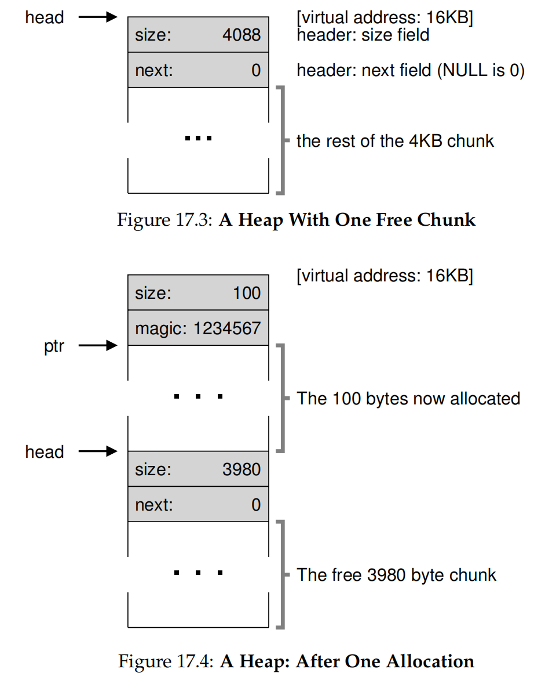
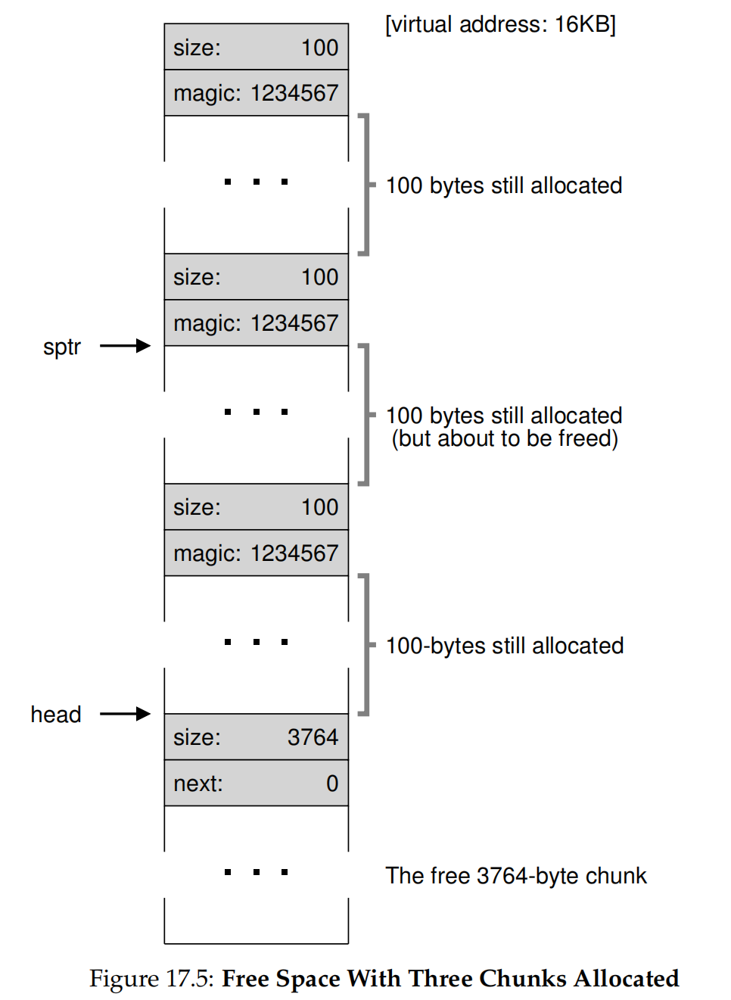

# 17 Free-Space Management

**external fregmentation:** the free space gets chopped into little pieces of different sizes and is thus fragmented; subsequent requests may fail because there is no signle contiguous space that can satisfy the request, even though the total amount of free space exceeds the size of the request.


## 17.2 Low-level Mechanisms

**Spliting and Coalescing**


the free list of this heap would be like:


**Tracking The Size Of Allocated Regions**

```c
typedef struct {
    int size;
    int magic;
} header_t;
```

**Embedding A Free List**

```c
typedef struct __node_t {
 int   size;
 struct __node_t *next;
} node_t;
```

initializes the heap and puts the first element of the free list inside that space:

```c
// mmap() returns a pointer to a chunk of free space
node_t *head =
    mmap(NULL, 4096, PROT_READ | PROT_WRITE, MAP_ANON | MAP_PRIVATE, -1, 0);
head->size = 4096 - sizeof(node_t);
head->next = NULL;
```



upon the request for 100 bytes, the library allocated 108 bytes out of the existing one free chunk,



## 17.3 Basic Strategies

**Best Fit**

search through the free list and find chunks of free memory that are as big or bigger than the requested size.

**Worst Fit**

find the largest chunk and return the requested amount; keep the remaining (large) chunk on the free list. Worst fit tries to thus leave big chunks free instead of lots of small chunks that can arise from a best-fit approach.

**First Fit**

simply finds the first block that is big enough and returns the requested amount to the user. use **address-based ordering;**

**Next Fit**

keeps an extra pointer to the location within the list where one was looking last.

The idea is to spread the searches for free space throughout the list more uniformly, thus
