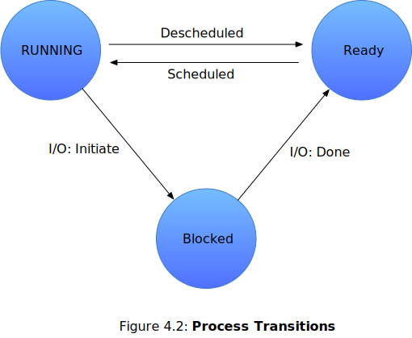

# 4 The Abstraction: The Process #

## 4.1 The Abstraction: The Process ##
    
__abstraction__: a running program.


special registers:
- __program counter (PC)/instruction pointer (IP)__: tells us which instruction of the program will execute next;
- __stack pointer(SP)__: associated __frame pointer__ are used to manage the stack for function parameters, local variables, and return address.

## 4.2 Process API ##

- __Create__: An operating system must include some method to create new processes.
- __Destroy__: destroy a process
- __Wait__: wait a process to stop running
- __Miscellaneous Control__: other than killing or waiting for a process, a process can be suspended or resume it 
- __Status__: get status information about a process

## 4.3 Process Creation: A Little More Detail ##


## 4.4 Process States ##

- __Running__: a process is on a processro
- __Ready__: a process is ready to run but for some reason the OS has chosen not to run it as a given moment
- __Blocked__: a process has performed some kind of operation that makes it not ready to run until some other event take place. (e.g., keybord input)

<div style={{textAlign:'center'}}>

 

</div>

## 4.5 Data Structures ##

```c
// the registers xv6 will save and restore 
// to stop and subsequently restart a process 
struct context { 
    int eip;
    int esp;
    int ebx;
    int ecx;
    int edx;
    int esi;
    int edi;
    int ebp;
};


// the different states a process can be in 
enum proc_state { UNUSED, EMBRYO, SLEEPING, RUNNABLE, RUNNING, ZOMBIE };

// the information xv6 tracks about each process 
// including its register context and state 
struct proc {
    char * mem;                                  // Start of process memory
    uint sz;                                     // Size of process memory
    char * kstack;                               // Bottom of kernel stack for this process 
    enum proc_state state;                       // Process state
    int pid;                                     // Process ID
    struct proc * parent;                        // Parent process 
    void * chan;                                 // If !zero, sleeping on chan 
    int killed;                                  // If !zero, has been killed 
    struct file * ofile[NOFILE];                 // Open files 
    struct inode * cwd;                          // Current directory 
    struct context context;                      // Switch here to run process 
    struct trapframe * tf;                       // Trap frame for the 
};
```

