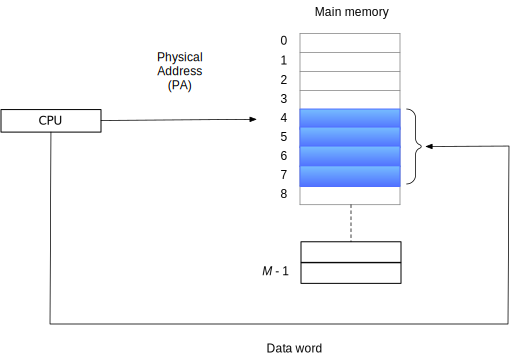
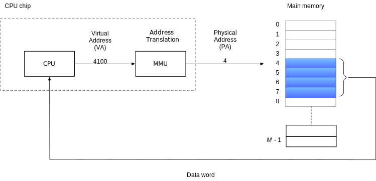
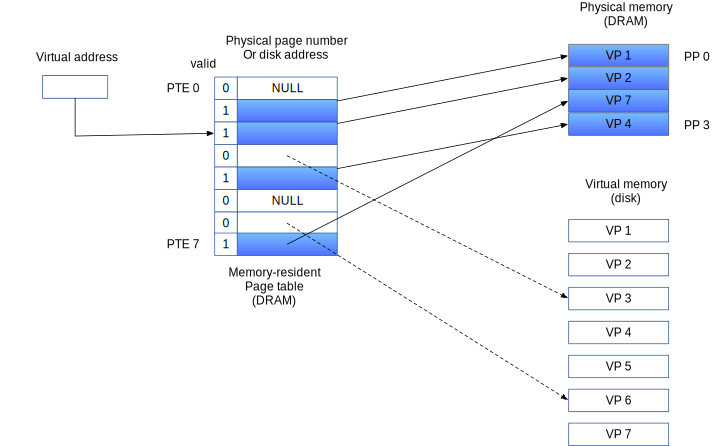
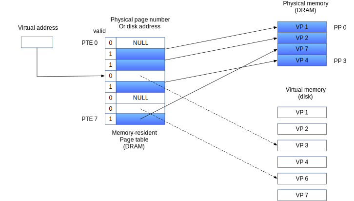
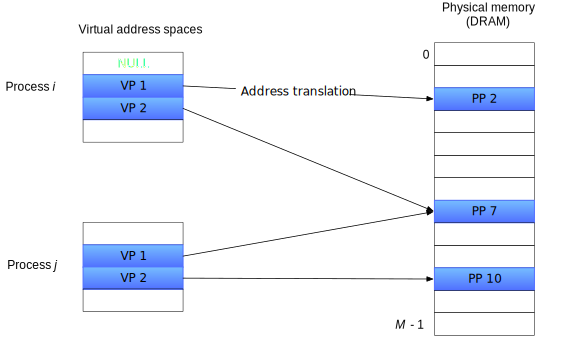

# Chapter 9. Virtual Memory #

## 9.1 Physical and Virtual Addressing ##

    The main memory of a computer is organized as an *array* of _M_ contiguous byte-size cells.
    

_Figure 9.1 A system that uses physical addressing._

 
 

_Figure 9.2  A system that uses virtual addressing_

the CPU access main memory by generating a _virtual address (VA)_ converted to physical address by 
_address translation_ in MMU.

## 9.2 Address Spaces ##

An _address space_ is an __ordered set of nonnegative interge__ addresses

{0, 1, 2, ...}

## 9.3 VM as a Tool for Cache ##

the set of virtual pages is partitioned into three disjoint subsets:
- Unallocated: Pages that have not yet been allocated (or created) by the VM system. do not have any data associated with them, and thus do not occupy any space on disk.
- Cached: Allocated pages that currently cached in physical memory.
- Uncached: Allocated pages that are not cached in physical memory.

_Figure 9.3 How a VM system uses main memory as a cache_

### 9.3.2 Page Tables ###

if cached, VM system must have way to determine which physical page it is cached in.

if missed, select a victim page in physical memory, and copy the virtual page from disk to DRAM, replace the victim page.

- PTEs: _page table entries_
- VPs: _virtual pages_

_Figure 9.4 Page table._

### 9.3.3 Page Hits ###

_Figure 9.5 VM page hit_

### 9.3.4 Page Faults ###

a DRAM cache miss is known as a _page fault_.

_Figure 9.6 VM page fault (before)_

The reference to a word in VP 3 is a miss and triggers a page fault.

 
 
 

_Figure 9.7 VM page fault (after)_

The page faults:
1. selects VP 4 as the victim (If VP 4 has been modified, then the kernel copies it back to disk).
2. replaces it with a copy of VP 3 from disk.

The kernel:
1. copies VP 3 from disk to PP 3 in memory
2. updates PTE 3,
3. VP 3 now cached in main memory

### 9.3.5 Allocating Pages ###

_Figure 9.8 Allocating a new virtual page_

## 9.3.6 Locality to the Rescue Again ##

_Figure __9.9 How VM provides processes with separate address spaces.__The operating system matains a separate page table for each process in the system_

## 9.4 VM as a Tool for Memory Management ##
